## Knowledge Graph

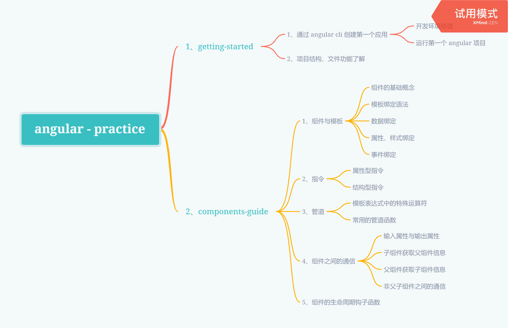


## Step by Step

### 1、组件与模板

#### 1.1、组件的基础概念

组件包含了一组特定的功能，每个组件的功能都单一且独立的，可以进行重复使用；组件可以通过 angular cli 进行创建，生成的组件位于工作空间的 src/app/ 路径下面

```shell
## 创建一个 product-list 组件
ng g component product-list
```

当需要将组件放置在某个指定的目录下时，可以直接在 ng g 命令中添加路径

```shell
## 将 hero 组件生成到 components 路径下
ng g component components/hero
```

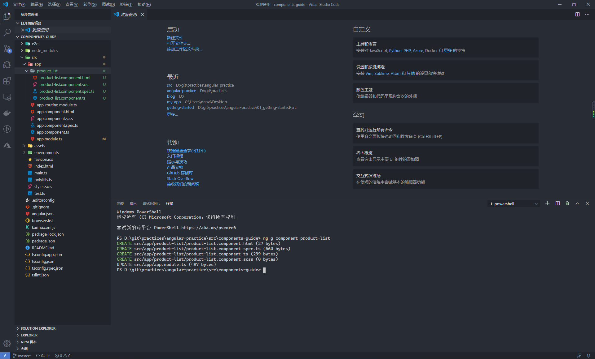

angular 应用就是通过一个个的组件所构成的组件树，一个组件包含了如下的四个部分

- product-list.component.ts：组件类，用来处理数据和功能，为视图呈现提供支持
- product-list.component.html：组件对应的页面 HTML 模板，用来呈现组件的功能
- product-list.component.scss：只针对当前组件的样式
- product-list.component.spec.ts：当前组件的单元测试文件（非必须）

当通过命令行创建一个新的组件之后，会自动将新创建的组件注册到应用的根模块（app.module.ts）中

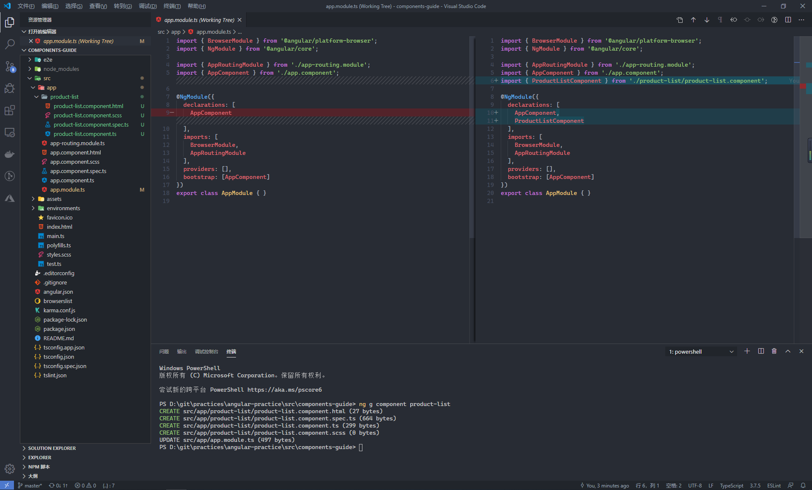

在组件类中，通过使用 @Component 装饰器 [^1] 用来将后面的类声明为组件类，并为这个组件类配置一些元数据 [^2]，以决定该组件在运行期间该如何处理、实例化和使用

装饰器中存在三个基础的配置参数，用来完成组件与视图之间的关联

- selector：选择器，当我们在页面上添加了这个选择器指定的标签（`<app-product-list></app-product-list>`）后，就会在当前使用位置上创建并插入这个组件的一个实例
- templateUrl：该组件所对应的 HTML 模板文件地址
- styleUrls：该组件视图所特有的 css 样式文件地址

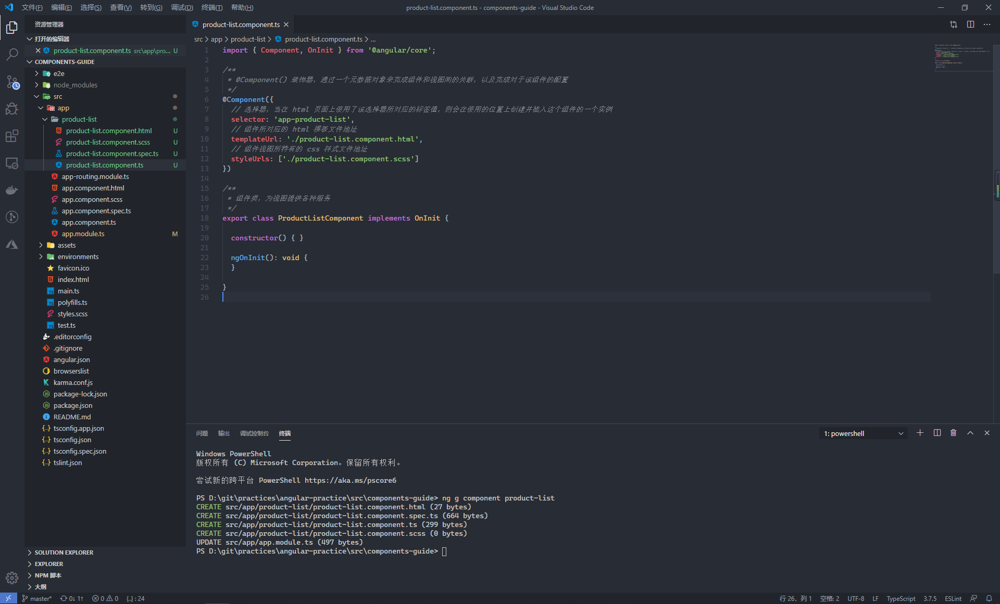

当需要使用这个组件时，直接在页面上添加选择器对应的标签就可以了

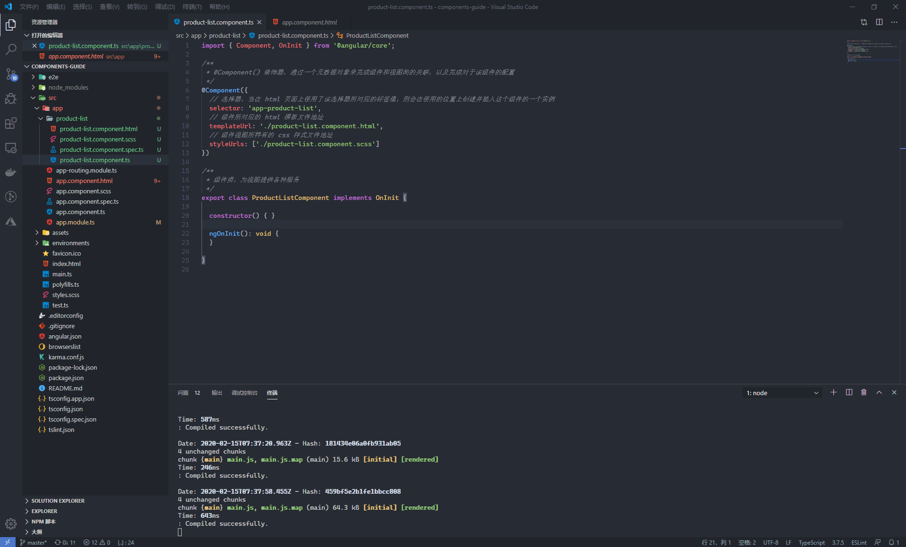


#### 1.2、模板绑定语法

在 angular 应用中，组件扮演着控制器或者视图模型的作用，而这里创建组件时关联的视图 html 则是一个基础的 angular 模板

通过 angular 内置的模板语法与 html 元素进行结合，从而告诉 angular 如何根据我们的应用逻辑和数据来渲染页面 html

##### 1.2.1、插值表达式

插值可以将组件中的参数对应的值或者是一组数据通过模板表达式的方式进行计算，最终将值渲染到视图页面上

```typescript
import { Component, OnInit } from '@angular/core';

@Component({
  selector: 'app-product-list',
  templateUrl: './product-list.component.html',
  styleUrls: ['./product-list.component.scss']
})

export class ProductListComponent implements OnInit {

  public title = '我是 title 属性值';

  constructor() { }

  ngOnInit(): void {
  }
}
```

```html
<p>title：{{title}}</p>

<p>1+2+3+4+5={{1+2+3+4+5}}</p>
```

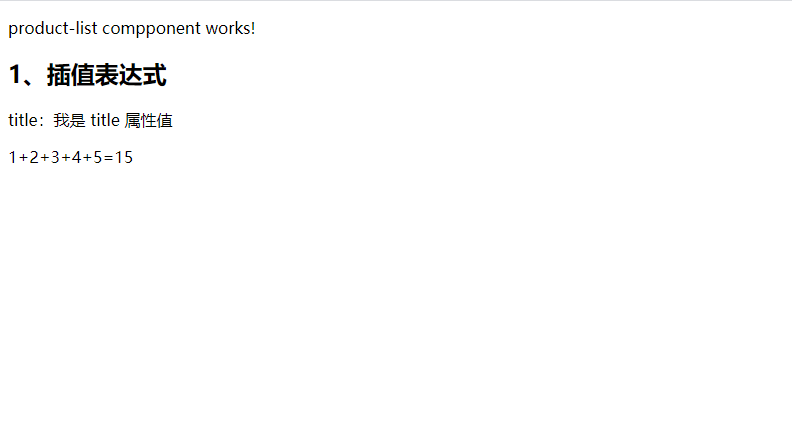

模板表达式的变量来源

- 模板本身的变量
- 指令的上下文变量
- 组件的成员信息（属性 or 方法）

在使用模板表达式时，如果变量名多个来源中都存在的话，则模板变量是最优先的，其次是指令的上下文变量，最后是组件的成员

在使用模板表达式时应该遵循如下的原则

- 简单：正常情况下，应该将业务逻辑或是数据运算放到组件中，模板表达式只作为属性或方法的调用
- 快速执行：模板表达式得出的数据应该快速结束，否则就会对于用户体验造成影响
- 没有可见的副作用：模板表达式只作为数据的展示，不应该改变任何的数据；应该构建出幂等的表达式，除非依赖的值发生变化，否则多次调用时，应该返回相同的数据信息

##### 1.2.2、模板绑定语法

通过数据绑定机制，将数据源与视图进行绑定，达成源数据与用户呈现的一致性

- 从数据源到视图：插值、组件中的属性、dom 元素的 property [^3]、css 样式、css 类
- 从视图到数据源：事件 
- 视图与数据源之间的双向绑定：数据对象

| 分类                                 | 语法                                                         |
| ------------------------------------ | ------------------------------------------------------------ |
| 单向<br />从数据源到视图             | 1、插值表达式：{{expression}}<br />2、使用 [] 进行绑定：`<a [href]='expression'></a>`<br />3、使用 bind 进行绑定：`<a bind-href='expression'></a>` |
| 单向<br />从视图到数据源             | 1、使用 () 进行绑定：`<a (click)='statement'></a>`<br />2、使用 on 进行绑定：`<a on-click='statement'></a>` |
| 双向<br />视图到数据源；数据源到视图 | 1、使用 [()] 进行绑定：`<input type="text" [(ngModel)]="product.Name">`<br />2、使用 bindon 进行绑定：`<input type="text" bindon-ngModel="product.Name">` |

```typescript
import { Component, OnInit } from '@angular/core';

@Component({
  selector: 'app-product-list',
  templateUrl: './product-list.component.html',
  styleUrls: ['./product-list.component.scss']
})

export class ProductListComponent implements OnInit {

  public title = '我是 title 属性值';
    
  public styleProperty = '<b>我是包含 html 标签的属性</b>';

  public fontColor = 'red';

  public url = 'https://yuiter.com';

  public name: string;

  constructor() { }

  ngOnInit(): void {
  }

  getUser() {
    alert('111111111');
  }
}
```

```html
<h3>2.1、从数据源到视图</h3>

<p>
  <a href='{{url}}'>使用插值表达式进行绑定</a>
</p>
<p>
  <a [href]='url' [style.color]='fontColor'>使用 [] 进行绑定</a>
</p>
<p>
  <a bind-href='url'>使用 bind 进行绑定</a>
</p>
<p>
  <span [innerHtml]="styleProperty"></span>
</p>

<h3>2.2、从视图到数据源</h3>

<p>
  <button (click)="getUser()">使用 () 进行绑定</button>
</p>
<p>
  <button on-click="getUser()">使用 on 进行绑定</button>
</p>

<h3>2.3、数据双向绑定 --- 需要在 AppModule 中添加对于 FormsModule 的引用</h3>

<p>
  <input type="text" id="userName" [(ngModel)]="name">
</p>
<p>
  <input type="text" bindon-ngModel="name">
</p>
```

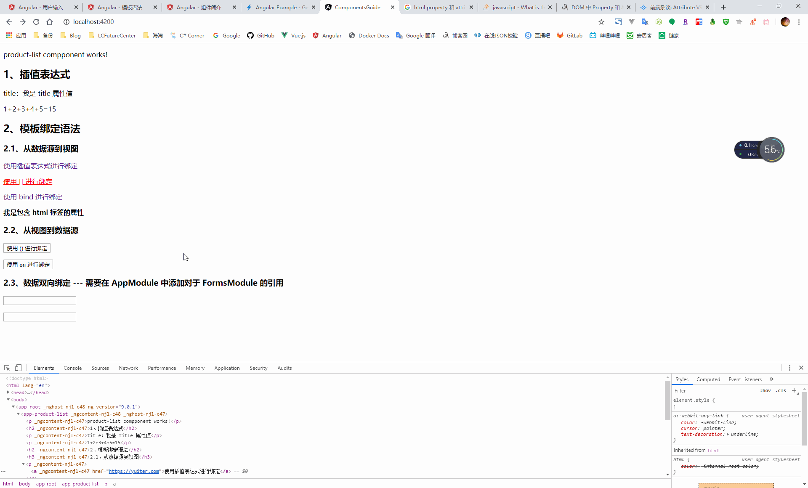

#### 1.3、数据绑定

- 单向数据绑定

  ```html
  <p>{{title}}</p>
  ```

- 双向数据绑定

  ```html
  <input type="text" id="userName" [(ngModel)]="name">
  
  <!-- 
    当没有 NgModel 时，双向数据绑定等同于下面的写法
   -->
  <input type="text" id="userName" [value]="name" (input)="name=$event.target.value">
  ```

#### 1.4、属性、样式绑定

- dom 元素的 property 绑定

  ```html
  
  
  
  ```

- html 标签的 attribute 绑定

  attribute 绑定的语法类似于 property 绑定，由前缀 `attr`、点（ `.` ）和 attribute 名称组成

  attribute 绑定的主要用例之一是设置 ARIA attribute（给残障人士提供便利）

  ```html
  <button [attr.aria-label]="actionName">{{actionName}} with Aria</button>
  ```

- style 内联样式绑定

  | 语法                     | 输入类型                    | 组件属性示例                                          |
  | ------------------------ | --------------------------- | ----------------------------------------------------- |
  | [style.width]="width"    | string \| undefined \| null | public width = "100px";                               |
  | [style.width.px]="width" | number\| undefined \| null  | public width = "20";                                  |
  | [style]="styleExpr"      | string                      | public styleExpr = "width: 100px; color:red";         |
  | [style]="styleExpr"      | {key:value}                 | public styleExpr = {width: '100px', height: '100px'}; |
  | [style]="styleExpr"      | array                       | public styleExpr = ["width", "100px"];                |

- class 属性绑定

  | 语法                 | 输入类型                  | 组件属性示例                                           |
  | -------------------- | ------------------------- | ------------------------------------------------------ |
  | [class.foo]="hasFoo" | bool \| undefined \| null | public hasFoo = true;                                  |
  | [class]="classExpr"  | string                    | public classExpr = "my-class1 my-class2";              |
  | [class]="classExpr"  | {key:value}               | public classExpr= {my-class1:  true, my-class2: true}; |
  | [class]="classExpr"  | array                     | public classExpr= ["my-class1", "my-class2"];          |

#### 1.5、事件绑定

在事件绑定中，可以通过 $event 参数获取到 dom 事件对象的属性从而获取到模板信息

```html
<input type="text" (keyup)="getMsg($event)">
<p>输入的值：{{msg}}</p>
```

```typescript
import { Component, OnInit } from '@angular/core';

@Component({
  selector: 'app-product-list',
  templateUrl: './product-list.component.html',
  styleUrls: ['./product-list.component.scss']
})

export class ProductListComponent implements OnInit {

  public msg: string;
  
  constructor() { }

  ngOnInit(): void {
  }

  getMsg(event: KeyboardEvent) {
    console.log(event);
    this.msg = (event.target as HTMLInputElement).value;
  }
}
```

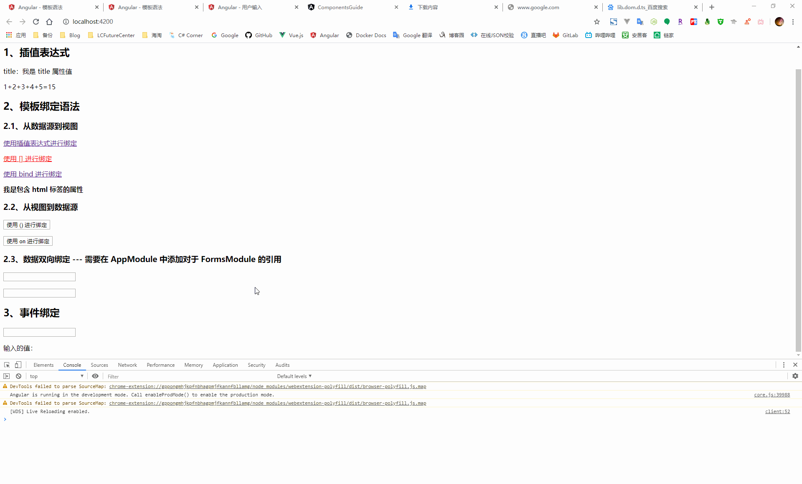

通过使用 $event 作为方法的参数会将许多用不到的模板信息传递到组件中，导致我们在仅仅是为了获取数据的前提下，却需要对于页面元素十分了解，违背了模板（用户所能看到的）与组件（应用如何去处理用户数据）之间的关注点分类的原则。因此，这里应该使用模板引用变量的方式获取数据信息。模板引用变量是对模板中 DOM 元素的引用，提供了从模块中直接访问元素的能力。

```html
<input type="text" #refMsgInput (keyup)="getRefMsg(refMsgInput.value)">
<p>通过模板引入变量的方式获取到输入的值：{{refMsg}}</p>
```

```typescript
import { Component, OnInit } from '@angular/core';

@Component({
  selector: 'app-product-list',
  templateUrl: './product-list.component.html',
  styleUrls: ['./product-list.component.scss']
})

export class ProductListComponent implements OnInit {

  public refMsg: string;

  constructor() { }

  ngOnInit(): void {
  }

  getRefMes(msg: string) {
    this.refMsg = msg;
  }
}
```

模板引用变量的作用域是整个模板，因此要确保一个模板中的引用变量名称是唯一的，同时，在声明引用变量时，也可以使用 ref- 代替 #

```html
<input type="text" ref-refMsgInput (keyup)="getRefMsg(refMsgInput.value)">
<p>通过模板引入变量的方式获取到输入的值：{{refMsg}}</p>
```


### 2、指令

#### 2.1、属性型指令

属性型指令被应用在视图 dom 元素上，用来改变 dom 元素的外观或行为

- NgClass：用来设置元素的多个 css 类属性，如果只设置一个 css 类，应该使用模板绑定语法中 class 类绑定

  ```html
  <p [ngClass]="inlineStyle">NgClass 属性指令</p>
  ```

  ```typescript
  import { Component, OnInit } from '@angular/core';
  
  @Component({
    selector: 'app-product-list',
    templateUrl: './product-list.component.html',
    styleUrls: ['./product-list.component.scss']
  })
  
  export class ProductListComponent implements OnInit {
  
    public inlineStyle: {};
  
    constructor() { }
  
    ngOnInit(): void {
      this.setInlineStyle();
    }
  
    setInlineStyle() {
      this.inlineStyle = {
        'text-red': true,
        'bg-blue': false,
      };
    }
  }
  ```

  这里的 text-red、bg-blue 都是 css 类名，如果想要在指定的元素上添加该类，则 css 类名对应的值为 true，反之则为 false

- NgStyle：用来设置元素的多个内联样式，如果只设置一个内联样式，应该使用模板绑定语法中的样式绑定

  ```html
  <p [ngStyle]="currentStyles">NgStyle 属性指令</p>
  ```

  ```typescript
  import { Component, OnInit } from '@angular/core';
  
  @Component({
    selector: 'app-product-list',
    templateUrl: './product-list.component.html',
    styleUrls: ['./product-list.component.scss']
  })
  
  export class ProductListComponent implements OnInit {
  
    public currentStyles: {};
  
    constructor() { }
  
    ngOnInit(): void {
      this.setCurrentStyles();
    }
  
    setCurrentStyles() {
      this.currentStyles = {
        'font-style': 'italic',
        'font-weight': 'bold',
        'font-size': '24px'
      };
    }
  }
  ```

  通过在组件的属性中设置多个内联样式对象的形式，完成元素样式的批量设置

- NgModel：双向数据绑定

  ```
  <input type="text" id="userName" [(ngModel)]="name">
  ```
  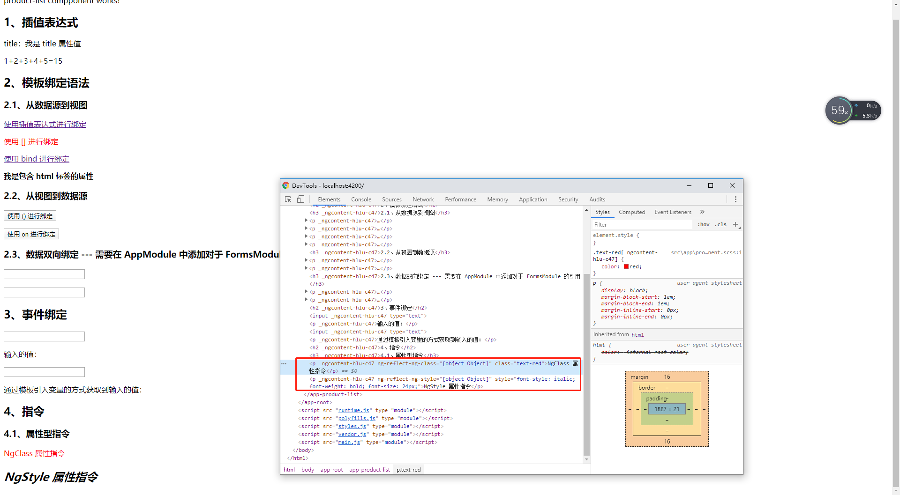

#### 2.2、结构型指令

结构型指令用来操作 dom 树，通过进行一些的逻辑判断，从而完成对于页面布局的修改

- NgIf：根据表达式的值（true or false）来创建或者销毁 dom 元素

  ```html
  <p *ngIf="expr">NgIf 结构型指令</p>
  ```

  当 expr 属性为 true 时，这个元素则会显示在页面上，当属性值为 false 时，则不显示该元素

  ngIf 指令并不是通过使用 css 样式来隐藏元素的，当值为 false 时，则这些元素会从 dom 中被销毁，并且所有监听该 dom 元素的事件会被取消，当重新显示该元素时，会执行初始化的过程

  而对于隐藏的元素来说，所有的元素监听事件还会执行监听，重新显示时组件不用进行重新初始化

- NgFor：通过定义单条数据的显示格式，angular 以此为模板，循环渲染出所有的数据

  ```html
  <p *ngFor="let item of products; let i = index">{{i+1}} - {{item.name}} --- {{item.price}}</p>
  ```

  ```typescript
  import { Component, OnInit } from '@angular/core';
  
  @Component({
    selector: 'app-product-list',
    templateUrl: './product-list.component.html',
    styleUrls: ['./product-list.component.scss']
  })
  
  export class ProductListComponent implements OnInit {
  
    public products = [{
      'name': 'lalala',
      'price': '$200'
    }, {
      'name': 'hehehe',
      'price': '$400'
    }, {
      'name': 'wuwuwu',
      'price': '$120'
    }, {
      'name': 'xixi',
      'price': '$570'
    }];
  
    constructor() { }
  
    ngOnInit(): void {
    }
  }
  ```

  NgFor 指令上下文中的 index 属性在每次迭代中，会获取到条数据的索引值

  当渲染的数据发生改变时 [^4]，会导致 dom 元素重新渲染，此时可以采用 trackBy 的方式，通过在组件中添加一个方法，指定需要跟踪的属性值，此时当渲染的数据发生改变时，只会重新渲染变更了指定的属性值的数据

  ```html
  <p>不使用 trackBy 跟踪属性</p>
  <div>
    <p *ngFor="let item of products; let i = index;">
      {{i+1}} - {{item.name}} --- {{item.price}}
    </p>
  </div>
  <p>使用 trackBy 跟踪属性</p>
  <div>
    <p *ngFor="let item of products; let i = index; trackBy: trackByIndex">
      {{i+1}} - {{item.name}} --- {{item.price}}
    </p>
  </div>
  <button (click)="addProduct()">新增</button>
  ```

  ```typescript
  import { Component, OnInit } from '@angular/core';
  
  @Component({
    selector: 'app-product-list',
    templateUrl: './product-list.component.html',
    styleUrls: ['./product-list.component.scss']
  })
  
  export class ProductListComponent implements OnInit {
  
    public products = [{
      'name': 'lalala',
      'price': '$200'
    }, {
      'name': 'hehehe',
      'price': '$400'
    }, {
      'name': 'wuwuwu',
      'price': '$120'
    }, {
      'name': 'xixi',
      'price': '$570'
    }];
  
    constructor() { }
  
    ngOnInit(): void {
    }
  
    trackByIndex(index: number, item: any): string {
      return item.price;
    }
  
    addProduct() {
      this.products = [{
        'name': 'lalala',
        'price': '$200'
      }, {
        'name': 'hehehe',
        'price': '$400'
      }, {
        'name': 'wuwuwu',
        'price': '$120'
      }, {
        'name': 'xixi',
        'price': '$570'
      }, {
        'name': 'lululu',
        'price': '$' + (Math.random() * 100).toFixed()
      }];
    }
  }
  ```

  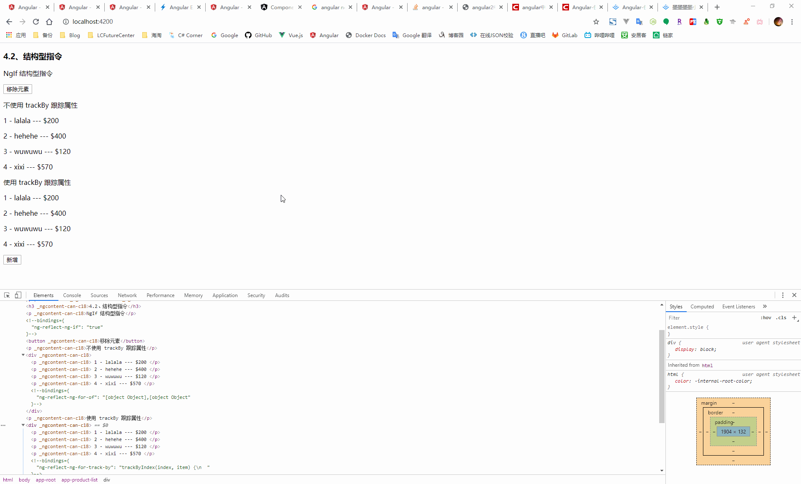

- NgSwitch：根据条件切换，从候选的几个元素中选择匹配的，放到 dom 元素中

  ```html
  <p>
    请选择配置
    <select [(ngModel)]="config">
      <option value="">请选择</option>
      <option value="r7-3700x">AMD Ryzen 7 3700X</option>
      <option value="i5-9400f">Intel i5 9400F</option>
      <option value="i5-9600kf">Intel i5 9600KF</option>
    </select>
  </p>
  <p> 配置描述 </p>
  <div [ngSwitch]="config">
    <p *ngSwitchCase="'r7-3700x'">
      一个能打得都木的~~~
    </p>
    <p *ngSwitchCase="'i5-9400f'">
      挤牙膏的。。。
    </p>
    <p *ngSwitchCase="'i5-9600kf'">
      别看了，我不是开封菜。。。
    </p>
    <p *ngSwitchDefault>
      你选一个啊~~~
    </p>
  </div>
  ```

  ```typescript
  import { Component, OnInit } from '@angular/core';
  
  @Component({
    selector: 'app-product-list',
    templateUrl: './product-list.component.html',
    styleUrls: ['./product-list.component.scss']
  })
  
  export class ProductListComponent implements OnInit {
  
    public config = '';
  
    constructor() { }
  
    ngOnInit(): void {
    }
  }
  ```

  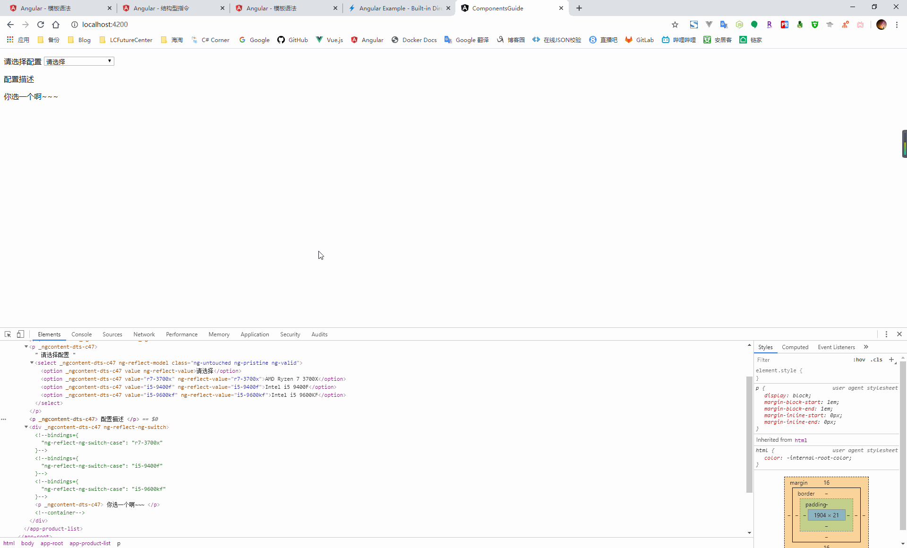
  
  NgSwitch 本身是一个属性型指令，它不会直接操作 dom 元素，而是通过它所控制的两个结构型指令（NgSwitchCase、ngSwitchDefault）来操作 dom 元素


### 3、管道

在使用模板表达式绑定数据时，对于表达式的结果进行转换，管道是一种简单的函数，它们接受输入值并返回转换后的值。通过在模板表达式中使用管道运算符（|）则可以完成相应的结果转换

#### 3.1、模板表达式中的特殊运算符

angular 模板表达式是 javascript 的子集，相对于常见的 javascript 运算符，添加了三个特殊的运算符

- 管道运算符

  管道是一种特殊的函数，可以把运算符（|）左边的数据转换成期望呈现给视图的数据格式，例如，将时间进行格式化、将数据转换成 json 字符串的形式等等

  可以针对一个数据使用多个管道进行串联，并且管道运算符的优先级比三元运算符（ ?: ）高

  ```html
  <h3>5.1、管道运算符</h3>
  <div>
    <p>产品信息 json 字符串</p>
    {{products | json}}
  </div>
  ```

  

- 安全导航运算符

  在视图中使用的属性值为 null or undefined 时，javascript 和 angular 会引发空指针异常并中断视图的渲染过程， 从而视图会渲染失败，而使用了安全导航运算符（?）后，视图依然会渲染，只是显示的值为空白

  ```html
  <h3>5.2、安全导航运算符</h3>
  <p>第五个专案的名称为：{{products[5].name}}</p>
  ```

  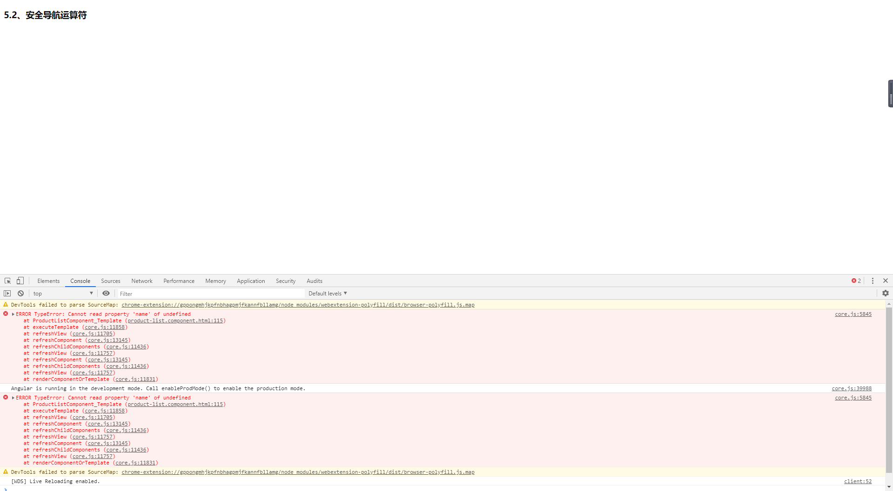
  
  ```html
  <p>第五个专案的名称为：{{products[5]?.name}}</p>
  ```
  
  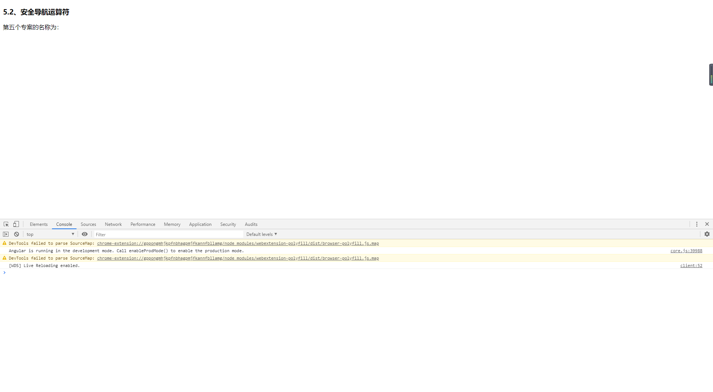
  
- 非空断言运算符

  在 tsconfig.json 中启用 strictNullChecks 属性，typescript 将会强制开启严格的空值检查，在这种模式下，所有定义了类型的属性是不允许赋值为 null 的，当将属性赋值为 null，则会编译报错

  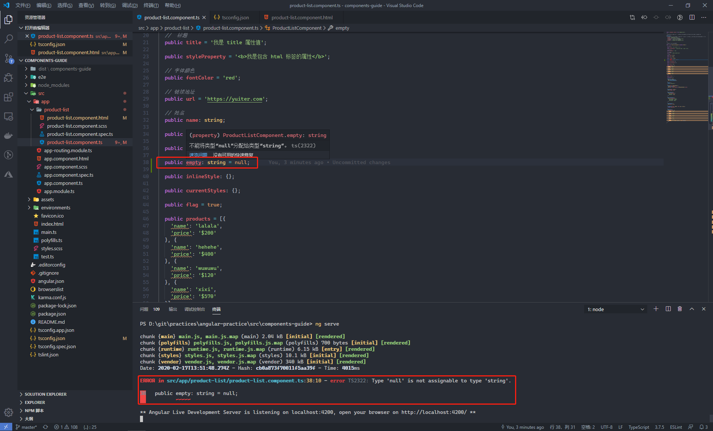
  
  非空断言运算符用来告诉编译器对特定的属性不做严格的空值校验，当属性值为 null or  undefined 时，不抛错误。在下面的代码中，在判断 obj 存在后，就不再针对 obj.name 进行校验

  ```typescript
  import { Component, OnInit } from '@angular/core';
  
  interface Person {
      name: string;
      age: number;
    }
  
    @Component({
      selector: 'app-product-list',
      templateUrl: './product-list.component.html',
      styleUrls: ['./product-list.component.scss']
    })
  
    export class ProductListComponent implements OnInit {
  
      public obj: Person;     
        
      constructor() {
      }
        
      ngOnInit(): void {
      }
  
    }
  ```
  
  ```html
  <p *ngIf="obj">
    <span>{{obj!.name}}</span>
  </p>
  ```
  
  非空断言运算符不会防止出现 null 或 undefined，只是不提示

#### 3.2、常用的管道函数

- 纯管道

  有在它检测到输入值发生了纯变更时才会执行，但是会忽略对象内部的变更

  纯变更是指对原始类型值（String、Number、Boolean、Symbol）的更改， 或者对对象引用（Date、Array、Function、Object）的更改

- 非纯管道

  每个组件的变更周期都会执行

| 管道          | 作用                         | 示例                     |
| ------------- | ---------------------------- | ------------------------ |
| JsonPipe      | 将一个值转换成 json 字符串   | {{ value \| json }}      |
| DatePipe      | 根据区域设置规则格式化日期值 | {{ value \| date }}      |
| UpperCasePipe | 把文本转换成全大写形式       | {{ value \| uppercase }} |
| LowerCasePipe | 把文本转换成全小写形式       | {{ value \| lowercase}}  |

```html
<h3>6.1、json 管道</h3>
<p>{{products | json}}</p>

<h3>6.2、date 管道</h3>
<p>现在时间：{{date | date:'yyyy-MM-dd HH:mm:ss'}}</p>

<h3>6.3、upper 管道</h3>
<p>转换成全大写：{{url | uppercase}}</p>

<h3>6.4、lower 管道</h3>
<p>转换成全小写：{{url | lowercase}}</p>
```


### 4、组件之间的通信

#### 4.1、子组件获取父组件信息

#### 4.2、父组件获取子组件信息


### 5、组件的生命周期钩子函数


[^1]: 装饰器是一种特殊类型的声明，它能够被附加到类声明，方法， 访问符，属性或参数上，就像是 C# 中的特性
[^2]: 元数据是用来描述数据的数据项，例如这里的 selector 是为了描述 Component 这个数据信息资源中抽取出来用于说明其特征的一个结构化的数据
[^3]:property 是 dom 元素默认的基本属性，在 dom 初始化时会被全部创建，而 attribute 是 html 标签上定义的属性和值 =》[DOM 中 Property 和 Attribute 的区别](https://www.cnblogs.com/elcarim5efil/p/4698980.html)
[^4]:这里的数据改变指的是会将原来的数据对象重新销毁然后重建的过程，因此像 push、unshift 这样的方法即使不添加 trackBy 也不会重新渲染整个 DOM，只会重新渲染改变的数据
