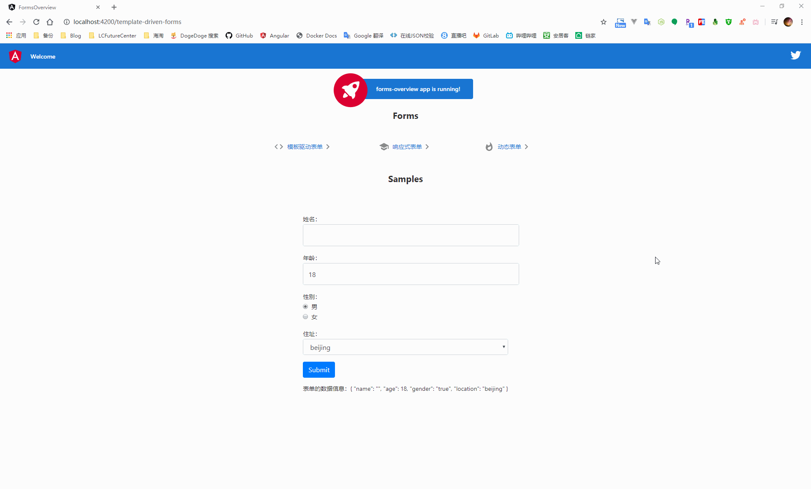
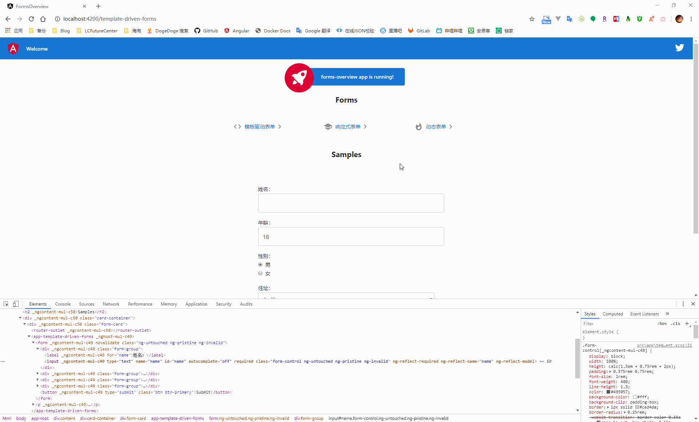
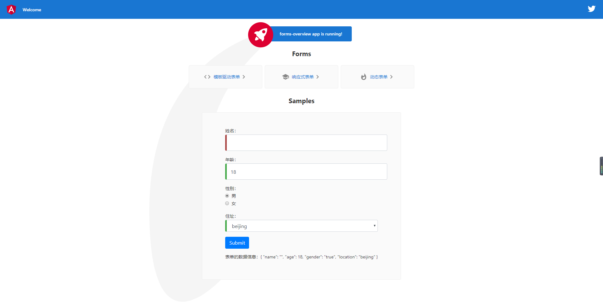
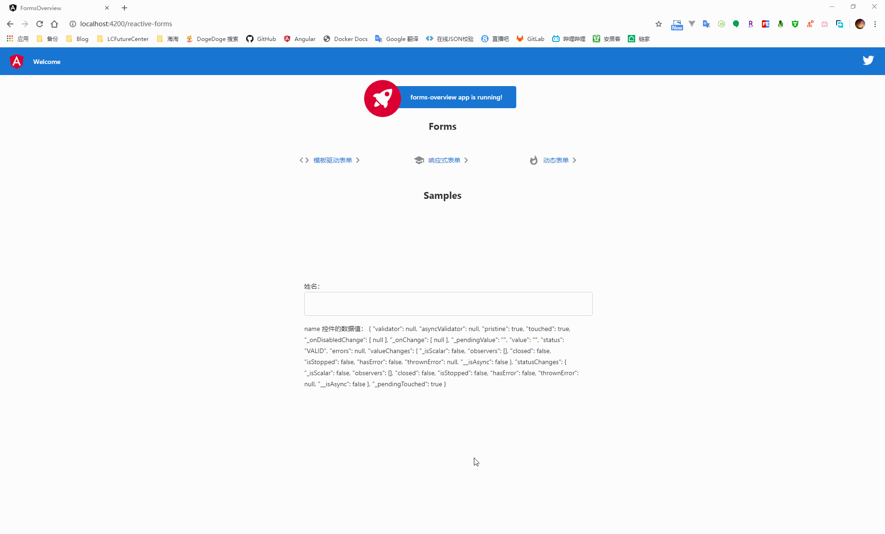
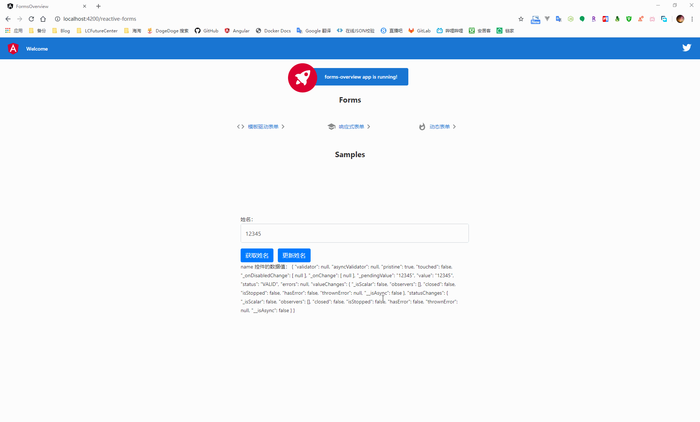
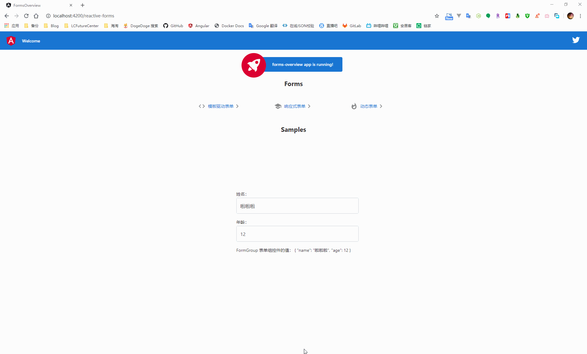
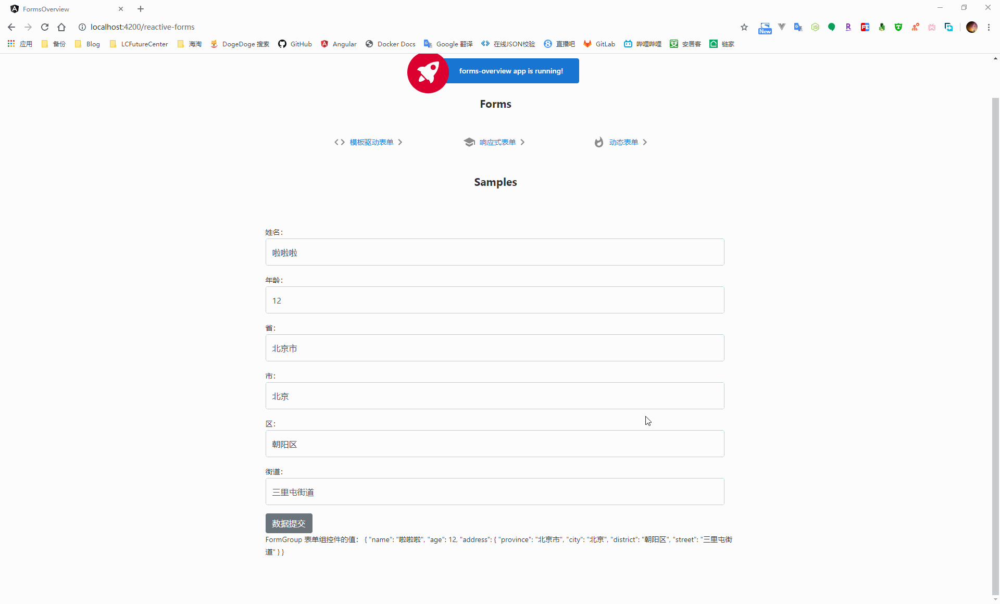
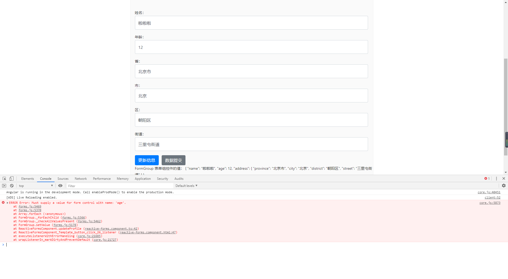
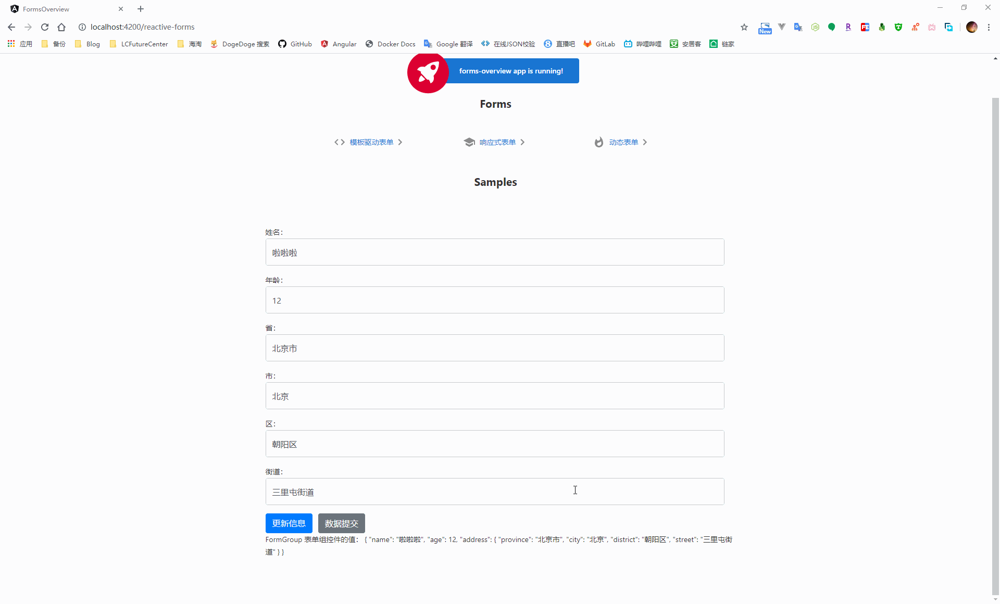
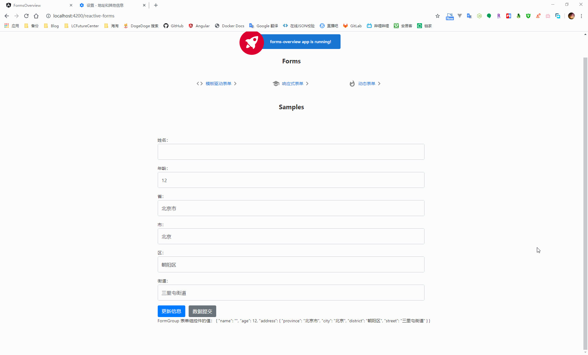

## Knowledge Graph


## Step by Step

### 1、表单简介

用来处理用户的输入，通过从视图中捕获用户的输入事件、验证用户输入的是否满足条件，从而创建出表单模型修改组件中的数据模型，达到获取用户输入数据的功能

|          | 模板驱动表单         | 响应式表单         |
| -------- | -------------------- | ------------------ |
| 建立表单 | 由组件隐式的完成创建 | 在组件类中进行创建 |
| 数据模式 | 非结构化数据         | 结构化数据         |
| 表单验证 | 指令                 | 函数               |

在数据发生了变更时，模板驱动表单在模板数据发生变更时修改原来的数据模型，而响应式表单在表单数据发生变更时，FormControl 实例会返回一个新的数据模型，而不是直接修改原来的数据模型


### 2、模板驱动表单

通过使用表单的专属指令（例如 ngModel 进行双向数据绑定）将数据值和一些对于用户的行为约束（某个字段必须填啊、某个字段长度超过了长度限制啊）绑定到组件的模板中，从而完成与用户的交互

#### 2.1、模板驱动表单的双向数据绑定

在根模块中引入 FormsModule，并添加到根应用模模块中的 imports 数组中

```typescript
import { BrowserModule } from '@angular/platform-browser';
import { NgModule } from '@angular/core';

// 引入 FormsModule
import { FormsModule } from '@angular/forms';

import { AppRoutingModule } from './app-routing.module';
import { AppComponent } from './app.component';
import { TemplateDrivenFormsComponent } from './template-driven-forms/template-driven-forms.component';

@NgModule({
  declarations: [
    AppComponent,
    ReactiveFormsComponent,
    DynamicFormsComponent,
    TemplateDrivenFormsComponent
  ],
  imports: [
    BrowserModule,
    AppRoutingModule,
    FormsModule // 添加到应用模块中
  ],
  providers: [],
  bootstrap: [AppComponent]
})
export class AppModule { }
```

新建一个类文件，用来承载组件与模板之间进行双向数据绑定的数据信息

```bash
ng g class classes/hero
```

```typescript
export class Hero {

  /**
   * ctor
   * @param name 姓名
   * @param age 年纪
   * @param gender 性别
   * @param location 住址
   */
  constructor(public name: string, public age: number, public gender: string, public location: string) {
  }
}
```

在组件的模板中创建承载数据的表单信息，并使用 ngModel 完成组件与模板之间的数据双向绑定

```html
<form>
  <div class="form-group">
    <label for="name">姓名：</label>
    <input type="text" name="name" id="name" [(ngModel)]="hero.name" class="form-control" autocomplete="off" required minlength="4">
  </div>
  <div class="form-group">
    <label for="age">年龄：</label>
    <input type="number" name="age" id="age" [(ngModel)]="hero.age" class="form-control" required>
  </div>
  <div class="form-group">
    <label for="gender">性别：</label>
    <div class="form-check" *ngFor="let gender of genders">
      <input class="form-check-input" type="radio" name="gender" id="{{gender.id}}" value="{{gender.value}}"
        [(ngModel)]="hero.gender">
      <label class="form-check-label" for="{{gender.id}}">
        {{gender.text}}
      </label>
    </div>
  </div>
  <div class="form-group">
    <label for="location">住址：</label>
    <select name="location" id="location" [(ngModel)]="hero.location" class="form-control" required>
      <option value="{{location}}" *ngFor="let location of locations">{{location}}</option>
    </select>
  </div>
  <button type="submit" (click)="submit()" class="btn btn-primary">Submit</button>
</form>

<p>
  表单的数据信息：{{hero | json}}
</p>
```

```typescript
import { Component, OnInit } from '@angular/core';

import { Hero } from './../classes/hero';

@Component({
  selector: 'app-template-driven-forms',
  templateUrl: './template-driven-forms.component.html',
  styleUrls: ['./template-driven-forms.component.scss']
})
export class TemplateDrivenFormsComponent implements OnInit {
  constructor() { }

  // 性别选项
  public genders = [{
    id: 'male', text: '男', value: true
  }, {
    id: 'female', text: '女', value: false
  }];

  /**
   * 住址下拉
   */
  public locations: Array<string> = ['beijing', 'shanghai', 'hangzhou', 'wuhan'];

  hero = new Hero('', 18, 'true', 'beijing');

  ngOnInit(): void {
  }

  submit() {

  }
}
```



在使用 ngModel 进行模板绑定时，angular 在 form 标签上自动附加了一个 NgForm 指令，因为 NgForm 指令会控制表单中带有 ngModel 指令和 name 属性的元素，而 name 属性则是 angular 用来注册控件的 key，所以在表单中使用 ngModel 进行双向数据绑定时，必须要添加 name 属性

#### 2.2、跟踪表单控件的状态

在表单中使用 ngModel 之后，NgModel 指令通过更新控件的 css 类，达到反映控件状态的目的

| 状态             | 发生时的 css 类 | 没发生的 css 类 |
| ---------------- | --------------- | --------------- |
| 控件被访问       | ng-touched      | ng-untouched    |
| 控件的值发生变化 | ng-dirty        | ng-pristine     |
| 控件的值是否有效 | ng-valid        | ng-invalid      |



通过这些控件的 css 类样式，就可以通过添加自定义的 css 样式在用户输入内容不满足条件时进行提示

```css
.ng-valid[required], .ng-valid.required  {
  border-left: 5px solid #42A948; /* green */
}

.ng-invalid:not(form)  {
  border-left: 5px solid #a94442; /* red */
}
```




#### 2.3、数据的有效性验证

某些时候需要对于用户输入的信息做有效性验证，此时可以在控件上添加上[原生的 HTML 表单验证器](https://developer.mozilla.org/en-US/docs/Web/Guide/HTML/HTML5/Constraint_validation)来设定验证条件，当表单控件的数据发生变化时，angular 会通过指令的方式对数据进行验证，从而生成错误信息列表

在进行用户输入数据有效性验证时，在控件上通过添加一个模板引用变量来暴露出 ngModel，从而获取到控件的状态信息，之后就可以通过获取错误信息列表来进行反馈

```html
<div class="form-group">
    <label for="name">姓名：</label>
    <!--
      将 ngModel 指令通过模板引用变量的形式暴露出来，从而获取到控件的状态
     -->
    <input type="text" name="name" id="name" [(ngModel)]="hero.name" class="form-control" autocomplete="off" required
      minlength="4" #name="ngModel">
    <!--
      在用户有改动数据 or 访问控件之后才对数据的有效性进行验证
     -->
    <div *ngIf="name.invalid && (name.dirty || name.touched)" class="alert alert-danger">
      <div *ngIf="name.errors.required">
        姓名不能为空
      </div>
      <div *ngIf="name.errors.minlength">
        姓名信息不能少于 4 个字符长度
      </div>
    </div>
  </div>
```


在数据验证失败的情况下，对于系统来说，表单是不允许提交的，因此可以将提交事件绑定到表单的 ngSubmit 事件属性上，通过模板引用变量的形式，在提交按钮处进行数据有效性判断，当无效时，禁用表单的提交按钮

```html
<form (ngSubmit)="submit()" #heroForm="ngForm">
  <div class="form-group">
    <label for="name">姓名：</label>
    <!--
      将 ngModel 指令通过模板引用变量的形式暴露出来，从而获取到控件的状态
     -->
    <input type="text" name="name" id="name" [(ngModel)]="hero.name" class="form-control" autocomplete="off" required
      minlength="4" #name="ngModel">
    <!--
      在用户有改动数据 or 访问控件之后才对数据的有效性进行验证
     -->
    <div *ngIf="name.invalid && (name.dirty || name.touched)" class="alert alert-danger">
      <div *ngIf="name.errors.required">
        姓名不能为空
      </div>
      <div *ngIf="name.errors.minlength">
        姓名信息不能少于 4 个字符长度
      </div>
    </div>
  </div>
  <div class="form-group">
    <label for="age">年龄：</label>
    <input type="number" name="age" id="age" [(ngModel)]="hero.age" class="form-control" required>
  </div>
  <div class="form-group">
    <label for="gender">性别：</label>
    <div class="form-check" *ngFor="let gender of genders">
      <input class="form-check-input" type="radio" name="gender" id="{{gender.id}}" value="{{gender.value}}"
        [(ngModel)]="hero.gender">
      <label class="form-check-label" for="{{gender.id}}">
        {{gender.text}}
      </label>
    </div>
  </div>
  <div class="form-group">
    <label for="location">住址：</label>
    <select name="location" id="location" [(ngModel)]="hero.location" class="form-control" required>
      <option value="{{location}}" *ngFor="let location of locations">{{location}}</option>
    </select>
  </div>
  <button type="submit" [disabled]="!heroForm.form.valid" class="btn btn-primary">Submit</button>
</form>
```


### 3、响应式表单

#### 3.1、快速上手

响应式表单依赖于  ReactiveFormsModule 模块，因此在使用前需要在根模块中引入

```typescript
import { BrowserModule } from '@angular/platform-browser';
import { NgModule } from '@angular/core';

// 引入 ReactiveFormsModule
import { ReactiveFormsModule } from '@angular/forms';

import { AppRoutingModule } from './app-routing.module';
import { AppComponent } from './app.component';
import { ReactiveFormsComponent } from './reactive-forms/reactive-forms.component';

@NgModule({
  declarations: [
    AppComponent,
    ReactiveFormsComponent,
    DynamicFormsComponent,
    TemplateDrivenFormsComponent
  ],
  imports: [
    BrowserModule,
    AppRoutingModule,
    ReactiveFormsModule // 添加到应用模块中
  ],
  providers: [],
  bootstrap: [AppComponent]
})
export class AppModule { }
```

在使用响应式表单时，一个 FormControl 类的实例对应于一个表单控件，在使用时，通过将控件的实例赋值给属性进行保存。后续则可以通过监听这个自定义的属性来跟踪表单控件的值和状态

```typescript
import { Component, OnInit } from '@angular/core';

// 引入 FormControl 对象
import { FormControl } from '@angular/forms';

@Component({
  selector: 'app-reactive-forms',
  templateUrl: './reactive-forms.component.html',
  styleUrls: ['./reactive-forms.component.scss']
})
export class ReactiveFormsComponent implements OnInit {

  // 定义属性用来承接 FormControl 实例
  public name = new FormControl('');

  constructor() { }

  ngOnInit(): void {
  }

}
```

当在组件中创建好控件实例后，通过给视图模板上的表单控件添加 formControl 属性绑定，从而将控件实例与模板中的表单控件关联起来

```html
<form>
  <div class="form-group">
    <label for="name">姓名：</label>
    <input type="text" id="name" [formControl]='name' class="form-control" autocomplete="off">
  </div>
</form>


<div>
  name 控件的数据值： {{ name | json }}
</div>
```



通过使用 value 属性，可以获得当前表单控件的一份数据值拷贝，通过 setValue 方法则可以更新表单的控件值

```typescript
import { Component, OnInit } from '@angular/core';

// 引入 FormControl 对象
import { FormControl } from '@angular/forms';

@Component({
  selector: 'app-reactive-forms',
  templateUrl: './reactive-forms.component.html',
  styleUrls: ['./reactive-forms.component.scss']
})
export class ReactiveFormsComponent implements OnInit {

  // 定义属性用来承接 FormControl 实例
  public name = new FormControl('12345');

  constructor() { }

  ngOnInit(): void {
  }

  getName() {
    alert(this.name.value);
  }

  setName() {
    this.name.setValue(1111111);
  }
}
```



#### 3.2、通过 FomGroup 组合多个控件

一个表单不可能只有一个控件，通过在组件中构造 FormGroup 实例来完成对于表单控件的管理

在使用 FormGroup 时，同样在组件中定义一个属性用来承载类实例，然后将控件组中的每一个控件作为属性值添加到 FormGroup 类实例中

```typescript
import { Component, OnInit } from '@angular/core';

// 引入 FormControl 和 FormGroup 对象
import { FormControl, FormGroup } from '@angular/forms';

@Component({
  selector: 'app-reactive-forms',
  templateUrl: './reactive-forms.component.html',
  styleUrls: ['./reactive-forms.component.scss']
})
export class ReactiveFormsComponent implements OnInit {

  // 定义对象属性来承接 FormGroup 实例
  public profileForm = new FormGroup({
    name: new FormControl('啦啦啦'),
    age: new FormControl(12)
  });

  constructor() { }

  ngOnInit(): void {
  }
}
```

在视图模板中，将承接 FormGroup 实例的属性通过 FormGroup 指令绑定到 form 元素，然后将控件组的每一个属性通过 formControlName 绑定到具体对应的表单控件上


```html
<form [formGroup]='profileForm'>
  <div class="form-group">
    <label for="name">姓名：</label>
    <input type="text" id="name" formControlName='name' class="form-control" autocomplete="off" required minlength="4">
  </div>
  <div class="form-group">
    <label for="age">年龄：</label>
    <input type="number" id="age" formControlName='age' class="form-control" autocomplete="off" required step="1"
      max="100" min="1">
  </div>
</form>

<div>
  FormGroup 表单组控件的值： {{ profileForm.value | json }}
</div>
```



当构建复杂表单时，可以在 FormGroup 中通过嵌套 FormGroup 使表单的结构更合理

```typescript
import { Component, OnInit } from '@angular/core';

// 引入 FormControl 和 FormGroup 对象
import { FormControl, FormGroup } from '@angular/forms';

@Component({
  selector: 'app-reactive-forms',
  templateUrl: './reactive-forms.component.html',
  styleUrls: ['./reactive-forms.component.scss']
})
export class ReactiveFormsComponent implements OnInit {

  // 定义对象属性来承接 FormGroup 实例
  public profileForm = new FormGroup({
    name: new FormControl('啦啦啦'),
    age: new FormControl(12),
    address: new FormGroup({
      province: new FormControl('北京市'),
      city: new FormControl('北京'),
      district: new FormControl('朝阳区'),
      street: new FormControl('三里屯街道')
    })
  });

  constructor() { }

  ngOnInit(): void {
  }

  submit() {
    alert(JSON.stringify(this.profileForm.value));
  }
}
```

在视图模板中，通过使用 formGroupName 属性将 FormGroup 中的 FormGroup 实例绑定到控件上

```html
<form [formGroup]='profileForm' (ngSubmit)='submit()'>
  <div class="form-group">
    <label for="name">姓名：</label>
    <input type="text" id="name" formControlName='name' class="form-control" autocomplete="off" required minlength="4">
  </div>
  <div class="form-group">
    <label for="age">年龄：</label>
    <input type="number" id="age" formControlName='age' class="form-control" autocomplete="off" required step="1"
      max="100" min="1">
  </div>

  <div formGroupName='address'>
    <div class="form-group">
      <label for="province">省：</label>
      <input type="text" id="province" formControlName='province' class="form-control" autocomplete="off" required>
    </div>
    <div class="form-group">
      <label for="city">市：</label>
      <input type="text" id="city" formControlName='city' class="form-control" autocomplete="off" required>
    </div>
    <div class="form-group">
      <label for="district">区：</label>
      <input type="text" id="district" formControlName='district' class="form-control" autocomplete="off" required>
    </div>
    <div class="form-group">
      <label for="street">街道：</label>
      <input type="text" id="street" formControlName='street' class="form-control" autocomplete="off" required>
    </div>
  </div>

  <button type="submit" class="btn btn-primary" [disabled]="!profileForm.valid">数据提交</button>
</form>

<div>
  FormGroup 表单组控件的值： {{ profileForm.value | json }}
</div>
```



对于使用了 FormGroup 的表单来说，当使用 setValue 进行数据更新时，必须保证新的数据结构与原来的结构相同，否则就会报错

```typescript
import { Component, OnInit } from '@angular/core';

// 引入 FormControl 和 FormGroup 对象
import { FormControl, FormGroup } from '@angular/forms';

@Component({
  selector: 'app-reactive-forms',
  templateUrl: './reactive-forms.component.html',
  styleUrls: ['./reactive-forms.component.scss']
})
export class ReactiveFormsComponent implements OnInit {

  // 定义对象属性来承接 FormGroup 实例
  public profileForm = new FormGroup({
    name: new FormControl('啦啦啦'),
    age: new FormControl(12),
    address: new FormGroup({
      province: new FormControl('北京市'),
      city: new FormControl('北京'),
      district: new FormControl('朝阳区'),
      street: new FormControl('三里屯街道')
    })
  });

  constructor() { }

  ngOnInit(): void {
  }

  submit() {
    alert(JSON.stringify(this.profileForm.value));
  }

  updateProfile() {
    this.profileForm.setValue({
      name: '423'
    });
  }
}
```



某些情况下，我们只是想要更新其中的某个数据值，这时需要使用 patchValue 的方式更新其中的控件数据

```typescript
import { Component, OnInit } from '@angular/core';

// 引入 FormControl 和 FormGroup 对象
import { FormControl, FormGroup } from '@angular/forms';

@Component({
  selector: 'app-reactive-forms',
  templateUrl: './reactive-forms.component.html',
  styleUrls: ['./reactive-forms.component.scss']
})
export class ReactiveFormsComponent implements OnInit {

  // 定义对象属性来承接 FormGroup 实例
  public profileForm = new FormGroup({
    name: new FormControl('啦啦啦'),
    age: new FormControl(12),
    address: new FormGroup({
      province: new FormControl('北京市'),
      city: new FormControl('北京'),
      district: new FormControl('朝阳区'),
      street: new FormControl('三里屯街道')
    })
  });

  constructor() { }

  ngOnInit(): void {
  }

  submit() {
    alert(JSON.stringify(this.profileForm.value));
  }

  updateProfile() {
    this.profileForm.patchValue({
      name: '12345'
    });
  }
}
```




#### 3.3、使用 FormBuilder 生成表单控件

通过 FormGroup or FormControl 手动的构建表单控件的方式很麻烦，因此可以通过依赖注入 FormBuilder 类来完成表单控件的构建

FormBuilder 服务有三个方法：control、group 和 array，用于在组件类中分别生成 FormControl、FormGroup 和 FormArray

使用 FormBuilder 构建的控件，每个控件名对应的值都是一个数组，第一个值为控件的默认值，第二项和第三项则是针对这个值设定的同步、异步验证方法

```typescript
import { Component, OnInit } from '@angular/core';

// 引入 FormBuilder 构建表单控件
import { FormBuilder } from '@angular/forms';

@Component({
  selector: 'app-reactive-forms',
  templateUrl: './reactive-forms.component.html',
  styleUrls: ['./reactive-forms.component.scss']
})
export class ReactiveFormsComponent implements OnInit {

  /**
   * ctor
   * @param formBuilder 表单构造器
   */
  constructor(private formBuilder: FormBuilder) { }

  public profileForm = this.formBuilder.group({
    name: ['啦啦啦'],
    age: [12],
    address: this.formBuilder.group({
      province: ['北京市'],
      city: ['北京'],
      district: ['朝阳区'],
      street: ['三里屯街道']
    })
  });

  ngOnInit(): void {
  }
}
```

#### 3.4、数据的有效性验证

同模板驱动表单的数据有效性验证相同，在响应式表单中同样可以使用原生的表单验证器，在设定规则时，需要将模板中控件名对应的数据值的第二个参数改为验证的规则

因为在模板中没办法直接使用构建的表单对象中的控件，这里需要创建针对指定控件的 getter 方法，从而在模板中来获取到指定控件的状态

```typescript
import { Component, OnInit } from '@angular/core';

// 引入 FormBuilder 构建表单控件
import { FormBuilder } from '@angular/forms';

// 引入 Validators 验证器
import { Validators } from '@angular/forms';

@Component({
  selector: 'app-reactive-forms',
  templateUrl: './reactive-forms.component.html',
  styleUrls: ['./reactive-forms.component.scss']
})
export class ReactiveFormsComponent implements OnInit {

  /**
   * ctor
   * @param formBuilder 表单构造器
   */
  constructor(private formBuilder: FormBuilder) { }

  public profileForm = this.formBuilder.group({
    name: ['', [
      Validators.required,
      Validators.minLength(4)
    ]],
    age: [12],
    address: this.formBuilder.group({
      province: ['北京市'],
      city: ['北京'],
      district: ['朝阳区'],
      street: ['三里屯街道']
    })
  });

  // 添加需要验证控件 getter 方法，用来在模板中获取状态值
  get name() {
    return this.profileForm.get('name');
  }

  ngOnInit(): void {
  }
}
```

```html
<form [formGroup]='profileForm' (ngSubmit)='submit()'>
  <div class="form-group">
    <label for="name">姓名：</label>
    <input type="text" id="name" formControlName='name' class="form-control" autocomplete="off" required minlength="4">

    <!--
      在用户有改动数据 or 访问控件之后才对数据的有效性进行验证
     -->
    <div *ngIf="name.invalid && (name.dirty || name.touched)" class="alert alert-danger">
      <div *ngIf="name.errors.required">
        姓名不能为空
      </div>
      <div *ngIf="name.errors.minlength">
        姓名信息不能少于 4 个字符长度
      </div>
    </div>
  </div>
  <div class="form-group">
    <label for="age">年龄：</label>
    <input type="number" id="age" formControlName='age' class="form-control" autocomplete="off" required step="1"
      max="100" min="1">
  </div>

  <div formGroupName='address'>
    <div class="form-group">
      <label for="province">省：</label>
      <input type="text" id="province" formControlName='province' class="form-control" autocomplete="off" required>
    </div>
    <div class="form-group">
      <label for="city">市：</label>
      <input type="text" id="city" formControlName='city' class="form-control" autocomplete="off" required>
    </div>
    <div class="form-group">
      <label for="district">区：</label>
      <input type="text" id="district" formControlName='district' class="form-control" autocomplete="off" required>
    </div>
    <div class="form-group">
      <label for="street">街道：</label>
      <input type="text" id="street" formControlName='street' class="form-control" autocomplete="off" required>
    </div>
  </div>

  <button type="button" class="btn btn-primary" (click)="updateProfile()">更新信息</button> &nbsp;
  <button type="submit" class="btn btn-primary" [disabled]="!profileForm.valid">数据提交</button>
</form>

<div>
  FormGroup 表单组控件的值： {{ profileForm.value | json }}
</div>
```




### 4、表单的自定义数据验证


### 5、动态表单